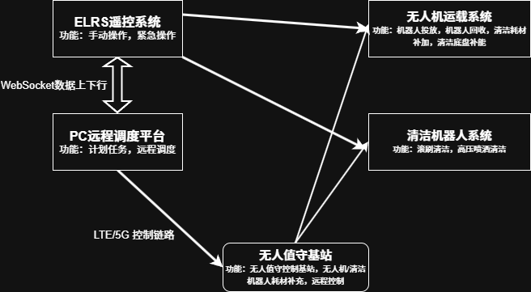

# 1. 系统概述

本系统旨在解决分布式光伏电站无人化值守过程中光伏组件的清洁问题。针对光伏组件表面积尘、鸟粪、植被遮挡导致发电效率下降（单块组件积尘可致发电损失 10%-35%）及分布式场景 “组件分散、地形复杂、人工清洁成本高、效率低” 的问题，构建 “空地协同智能清洁体系”。通过引入智能清洁机器人，与无人驾驶航空器配合，系统能够实现对光伏组件的自动清洁，提高光伏电站的发电效率和经济效益。

# 2. 系统组成

1. 智能清洁机器人，该机器人采用履带式运动底盘，配备了高效的滚筒清洁装置，与高压喷洒装置，能够自主规划路线并执行清洁任务。
2. 无人驾驶航空器，该航空器能够运载清洁机器人到达不同光伏组件，解决分布式光伏系统中发电组件分散的问题，通过电控机械结构，实现清洁机器人和无人驾驶航空器的组合分离，满足不同工况下的清洁需求。
3. 中控系统，使用PC上位机负责协调智能清洁机器人与无人驾驶航空器的工作，监控清洁过程，设置清洁计划任务，并进行数据分析和报告生成。
4. 图传系统，使用OPENipcamera作为图传设备，提供清洁机器人和无人驾驶航空器的实时视频回传，辅助操作员进行远程监控和控制。
5. 遥控系统，使用ELRS控制器作为近端控制工具，为现场操作员提供手动控制选项，适合非常规清洁任务或其它应用。

## 2.1 智能清洁机器人

### 硬件配置

|模块|参数|功能说明|
|-|-|-|
|运动底盘|履带式|克服光伏阵列间台阶、碎石等障碍，避免划伤组件表面|
|清洁执行单元|高压喷淋模组 + 旋转毛刷（软质尼龙材质）|高效清洁组件表面，适应不同类型的污染物|
|动力系统|24V 锂电池组|支持快充，适配户外低电量快速补能|
|感知系统|视觉摄像头 + 距离传感器|避障导航、识别组件污渍区域、板面建图、防坠落|
|对接机构|电磁卡扣 + 机械锁止结构|与无人机快速卡合 / 分离，承重≥15kg|
|控制系统|RK3588 协同处理|接收中控指令，执行清洁路径规划，实时反馈运行状态|

### 核心功能

1. 自主导航：构建光伏场地地图，规划最优清洁路径，避开组件边框、支架等障碍；
2. 智能清洁：根据污渍浓度自动调节喷淋压力（0.5-2MPa）与毛刷转速，实现 “轻污轻洗、重污深洗”；
3. 状态回传：实时上传清洁进度、组件表面清洁度、设备运行故障（如毛刷卡顿、动力不足）等数据至中控；
4. 自主停靠：完成单区域清洁后，自动返回指定停靠点，等待无人机转运或充电补能。

## 2.2 无人驾驶航空器

### 硬件配置

|模块|选型参数|功能说明|
|-|-|-|
|机架与动力|碳纤维板机架（激光切割工艺）+ 48V飞行平台|轻量化、高强度，抗风等级≥5 级，最大载重≥20kg
|飞控系统|STM32H7 专业飞控（集成 OSD、多传感器）|精准控制飞行姿态、高度、速度，支持 ELRS-Mavlink 链路通信，支持手动 / 自动模式切换|
|转运模块|电动升降臂 + 磁吸对接平台|精准抓取 / 释放清洁机器人，升降行程≥30cm，适配不同尺寸机器人|
|续航与动力|6S*2高倍率锂电池组|支持热插拔电池|
|感知系统|双目视觉 + GPS + 北斗 + 超声波|精准定位光伏组件位置，避障（避开高压电线、树木、支架），辅助转运对接|
|通信模块|ELRS 2.4G天线 + 5G 模组|接收中控 / 遥控指令，回传飞行姿态、位置、转运状态等数据|

## 2.3 中控系统

使用PC上位机作为中控系统，负责协调智能清洁机器人与无人驾驶航空器的工作，监控清洁过程，设置清洁计划任务，并进行数据分析和报告生成。中控系统通过图形化界面展示光伏电站的实时状态，包括清洁进度、设备状态、环境条件等信息，支持远程访问和控制，确保系统的高效运行和维护管理。QGC（QGroundControl）作为中控系统的软件平台，提供了丰富的功能模块，包括飞行控制、任务规划、数据分析等，支持多种无人机和机器人设备的集成，满足系统的多样化需求。

## 2.4 遥控系统

1. 主控设备：ELRS 专业遥控器，搭配高清显示屏；
2. 通信链路：ELRS 2.4G 双向无线链路，与无人机、机器人直连；
3. 功能按键：集成飞行模式切换、紧急停机、手动 / 自动模式切换、清洁参数调节等物理按键。

# 3. 系统通讯

系统通过无线通信技术实现交互控制,结合LTE/5G网络和局域网，确保智能清洁机器人、无人驾驶航空器和中控系统之间的实时数据传输和指令执行。

1. ExpressLRS（ELRS）无线通信协议，提供低延迟和高可靠性的通信连接，适用于近距离控制和数据传输。
2. Mavlink协议，Mavlink依赖ELRS物理链路传输，作为无人驾驶航空器与中控系统之间的通信协议，确保飞行控制和数据传输的高效性和可靠性。
3. LTE/5G网络，提供广域覆盖和高速数据传输能力，确保系统在不同地理位置的光伏电站中都能实现稳定的通信，为智能调度和远程监控提供支持。

## 3.1 ExpressLRS（ELRS）无线通信协议

ExpressLRS（ELRS）是开源、低延迟、长距的双向 RC 链路，控制以 CRSF 为主、MAVLink/SBUS 为辅，回传含链路状态 + 飞控遥测 + MAVLink 全量数据，支持单链路同时传控制与遥测

### 优势适配场景

* 近距离手动控制：遥控系统与无人机 / 机器人直连，延迟≤10ms，满足非常规作业精准操作需求；
* 无人机 - 机器人协同：ELRS 作为 Mavlink 的物理传输底层，确保转运过程中姿态同步、对接精准；
* 户外抗干扰：ELRS 开源协议支持自定义抗干扰策略，适配光伏电站复杂电磁环境，避免信号干扰。
## 3.2 Mavlink协议

Mavlink是一种轻量级的消息传递协议，广泛应用于无人机和其他机器人系统。它支持多种通信方式，包括串口、UDP和TCP，能够在不同的网络环境中灵活使用。Mavlink协议的主要特点是消息格式简单、易于解析，适合实时控制和数据传输。

### 传输依赖
基于 ELRS 物理链路传输，同时预留局域网备用通道，确保无人机飞控与中控、遥控系统的通信不中断；

## 3.3 LTE/5G网络

LTE/5G网络提供了高速、低延迟的无线通信能力，适用于大规模的物联网应用场景。在光伏电站的无人化值守系统中，LTE/5G网络可以实现对智能清洁机器人和无人驾驶航空器的远程控制和监控，确保系统的稳定性和可靠性。

